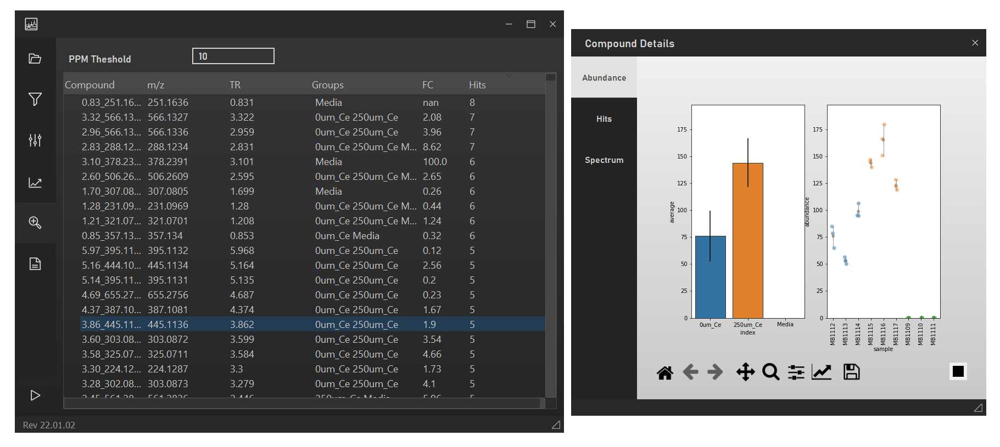
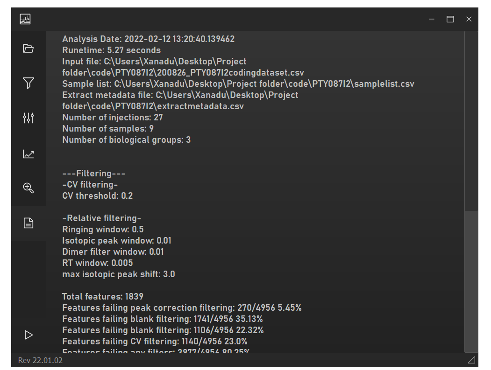

# Feature Info

From any feature-centric plot, open the compound details window with the
**Details** button (bottom-right), or by switching to the Feature Info tab
in the left pane (which opens it automatically).

## Selecting features

- Click a feature in a plot or the heatmap.
- Use the arrow keys, or click, while the feature-search tab is focused.
- In the heatmap, use **W**/**S** to step up/down through features.
- Click an already-selected feature again to deselect it.

Switching tabs in the compound details window (e.g. from Abundance to
Hits) does **not** change your selection or toggle the highlight — it just
re-displays whatever feature is currently selected.

*MPACT feature info tab showing a selected feature and its associated
information, including the compound details window with combined
uncertainty for the selected feature in biological groups (left) and
technical uncertainty in individual samples (right).*

## Abundance tab

- **Left plot:** group-level average abundance with the propagated
  uncertainty used in statistical calculations.
- **Right plot:** sample/replicate-level abundance — individual replicate
  points, sample average shown as a grey diamond, with 95% confidence-
  interval error bars per sample. Bar colours on the left match the
  biological-group colours used for points on the right.

## Spectrum

If a fragment database was provided at File Selection, the matched MS2
spectrum for the selected feature is shown here, with the option to launch
a MASST export to query it against the GNPS database.

## Hits tab

Lists compounds in the bundled Natural Products Atlas database whose mass
matches a sodiated or protonated adduct of the selected feature, within
the ppm tolerance set on this tab. Step through matches with the arrow
keys or by clicking the list; name, mass, ppm error, and taxonomic
information are shown per match, along with any available structure.
Filtering hits by kingdom/genus is also available. Support for additional
databases/adduct types is planned.

## Feature search / info table

Lists every filtered feature with its name, m/z, RT, the groups it was
detected in, fold change, database matches, and the -log p/q values used
in [Volcano plot](plots/volcano.md) generation. Selecting a row here
updates the highlighted feature everywhere else (plots, heatmap, compound
details window). Columns are sortable by clicking the header.

## Analysis Info

A text summary of the run — same content as the `analysisinfo.txt` file
written to the output directory (see [Outputs](user-guide/outputs.md)) —
so MPACT's run parameters can be reviewed later without re-opening the
session.

*MPACT analysis info tab.*
