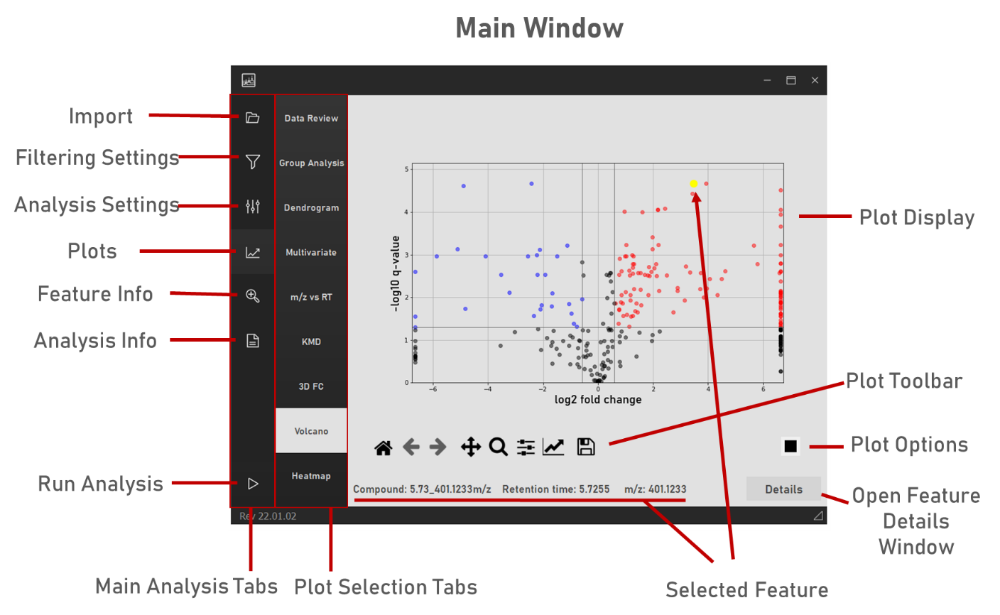
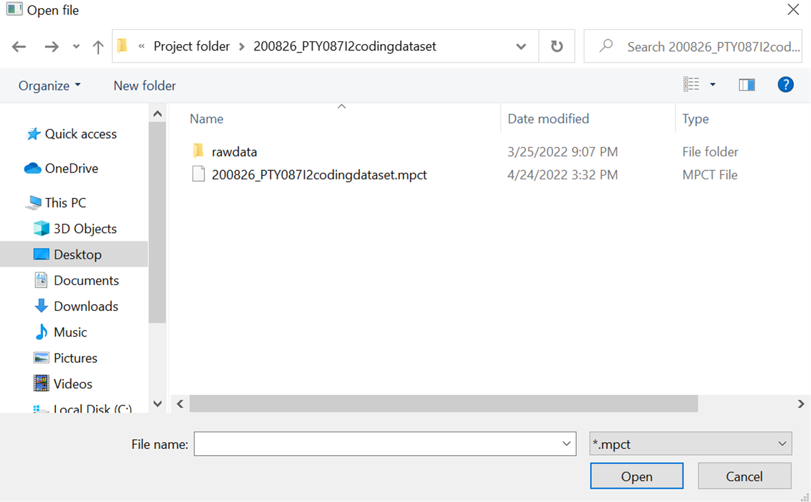

# Getting Started

## Launching MPACT

=== "Windows (standalone)"

    Double-click the **MPACT** shortcut in the repo root, or run
    `run.bat` directly. This activates Anaconda, changes into the `code/`
    directory (several relative paths in the app, like `npatlas.tsv` and
    `compoundimages/`, assume that working directory), and launches
    `main.py`.

    Note: when launched this way, an unhandled (non-fatal) error will
    terminate the program, since there's no IDE console to fall back on.
    If you hit a crash you want to investigate or just keep working
    through, launch via Spyder instead (below).

=== "Spyder / IDE (any OS)"

    1. Launch Spyder through Anaconda Navigator, or by typing `spyder`
       into the Anaconda Prompt.
    2. Navigate to the `code/` directory inside the repo.
    3. Open `main.py` (**not** `__main__.py`) in Spyder.
    4. Click the Run button (green arrow in the toolbar).

    This is also the recommended way to run MPACT while debugging, since
    non-fatal errors won't kill the whole session.

## The main window

MPACT's main window and the per-feature "compound details" window contain
all the main UI elements and analysis tools. Further plot navigation and
formatting options are available in the matplotlib toolbar under each
plot, and additional per-plot customization is available in each plot's
options dialog (the small button in the toolbar).

*Main MPACT window displaying key user interface elements.*

The basic workflow is:

1. **File Selection** — point MPACT at your peak table, sample list,
   metadata file, and (optionally) an MS/MS fragment database. See
   [File Selection](user-guide/file-selection.md).
2. **Filtering Settings** — configure mispicked-peak, blank, CV, and
   in-source-fragment filtering. See
   [Filtering Settings](user-guide/filtering-settings.md).
3. **Analysis Settings** — configure group presence/absence thresholds,
   which plots to generate, and the colour-coded "Plot Feature Sets". See
   [Analysis Settings](user-guide/analysis-settings.md).
4. **Run** — click Run. See [Running an Analysis](user-guide/running-analysis.md)
   for what happens and how long it takes.
5. **Explore results** — open the Plots pane and the Feature Info pane to
   review data quality, explore the dataset visually, and inspect
   individual features. See [Plots & Results](plots/data-review.md) and
   [Feature Info](feature-info.md).

## Loading a previous analysis

A previous MPACT analysis can be reloaded from the `.mpct` save file that
MPACT automatically writes to the output directory at the end of a run.
Use **Import from .MPCT session file** and select the save file — MPACT
will regenerate a working folder with all raw data and outputs alongside
it.

*Loading a `.mpct` file from a previously run analysis.*
