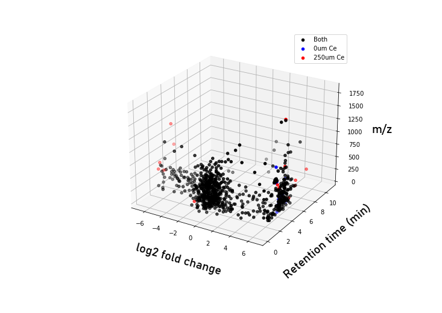

# 3D Fold Change

An interactive 3D plot of m/z, retention time, and fold change
(experimental vs. control group, as set in Analysis Settings). Useful for
spotting clusters of features that share mass, polarity, and
up-/down-regulation direction simultaneously.

*MPACT 3D fold change plot.*
