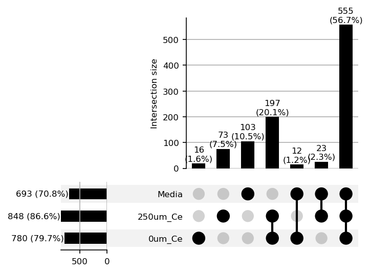
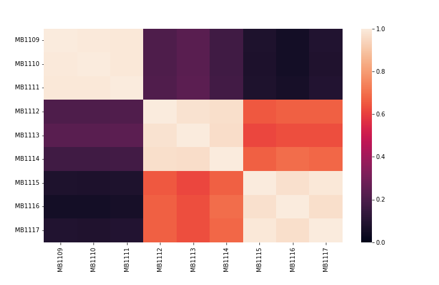
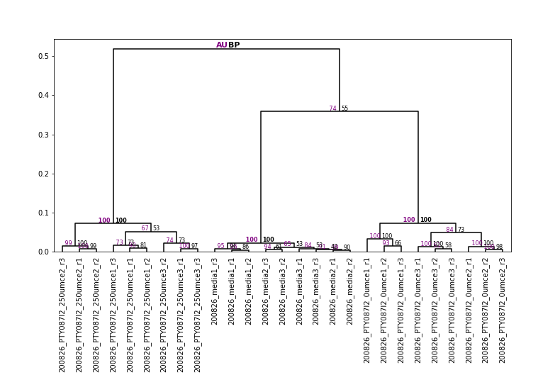

# Group Analysis

Visualizes differences between treatment groups via set analysis,
correlation analysis, and hierarchical clustering.

## UpSet Plot

Shows feature-set overlap across treatment groups: a bar chart of feature
counts per group (left), and the number of features present in each
combination of groups (top bar chart + dot matrix).

*MPACT UpSet plot showing the distribution of features across sample sets.*

## Spearman Correlation Matrix

Pairwise Spearman correlation between every group, useful for evaluating
overall metabolomic similarity at a glance. Colour scheme is configurable
in the plot options dialog.

*MPACT Spearman correlation matrix.*

## Dendrogram

Hierarchical clustering analysis (Ward's method) of samples and treatment
groups — useful both for assessing metabolomic similarity and for
sanity-checking your CV filter threshold (see
[Filtering Settings](../user-guide/filtering-settings.md#cv-reproducibility-filtering)).
For datasets where biological/treatment differences should exceed
technical noise, technical replicates should cluster together after
filtering.

Bootstrap analysis (1000 iterations) can be enabled in the plot options
dialog to annotate the dendrogram with approximately-unbiased (AU) p-values
and bootstrap probabilities (BP). AU values above 95 are generally
considered statistically significant. Bootstrap computation uses
`fastcluster` if it's installed (falling back to SciPy's hierarchical
clustering otherwise) for substantially faster linkage on large datasets.

*MPACT dendrogram after filtering, showing correct clustering of most
technical replicates and all biological groups. Approximately-unbiased
(AU) p-values greater than 95 are considered statistically significant.*
