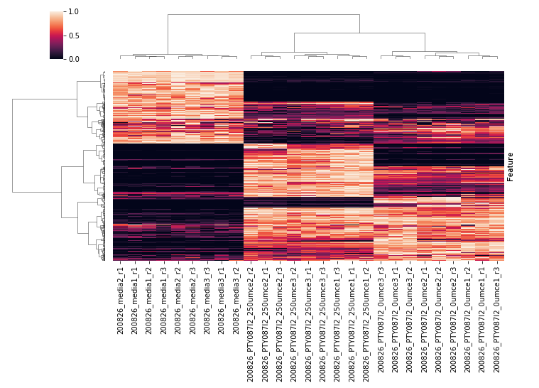

# Heatmap

Normalizes each feature's raw abundance between its own min and max, then
displays a samples (x-axis) × features (y-axis) heatmap.

- Samples are clustered (hierarchical clustering) by overall metabolomic
  similarity, like the [Dendrogram](group-analysis.md#dendrogram) tab —
  though clustering may differ slightly there since the heatmap uses
  normalized data.
- Features are clustered by similarity of their up-/down-regulation
  profile across samples.

This makes it easy to spot groups of co-regulated features for
prioritization. Colour scheme is configurable in the plot options dialog.

*MPACT heatmap grouping samples by overall metabolomic similarity (x-axis)
and features by overall distribution similarity across samples (y-axis).
Normalized abundance is denoted by cell colour, with lighter values
corresponding to higher abundance.*
