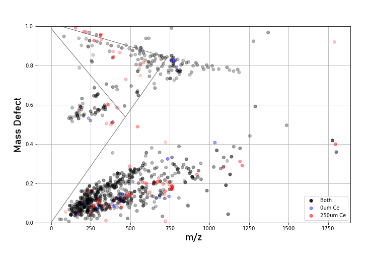
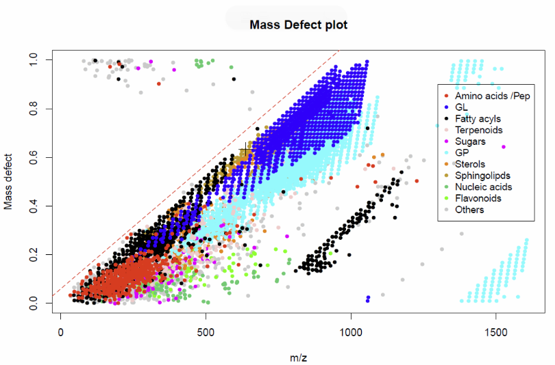

# Mass Defect

Mass defect (m/z minus the feature's nominal/integer mass) is a powerful
tool for prioritizing features and spotting families of related compounds,
since the shift in mass defect and nominal mass caused by a given molecular
transformation (hydrogenation, hydrolysis, methylation, etc.) is
consistent.

Different elements contribute differently to mass defect per Da of nominal
mass: hydrogen is strongly positive (+7.825 mDa/Da) along with other very
light elements, carbon is ~zero, and heavier atoms generally contribute
increasingly negative mass defect (nitrogen +0.220, oxygen −0.317, sulfur
−0.873 mDa/Da), peaking at iron. As a result, the **slope** a feature's
family traces on the mass-defect plot hints at its molecular character:

- Low slope: nucleotides/carbohydrates (heteroatom-rich), or highly
  unsaturated/hydrogen-deficient cyclic polyketides.
- High slope: aliphatic hydrocarbons (maximum positive mass defect for a
  given mass), and fatty acids/lipids.

*MPACT mass defect plot. Note the trend of features with negative slope at
the top of the chart, corresponding to salt clusters, as well as a series
of low-mass features around 0.5 Da below the main feature cluster — likely
unresolved doubly-charged dimer fragments. The main cluster sits in the
region where polyketide synthase (PKS) products and amino acid derivatives
are typically found.*

Reference trendlines for saturated hydrocarbons, perbromocarbons, and
polycarbonic acids can be toggled in the plot options dialog:

- Singly-charged CHNOPS-formula features fall below the hydrocarbon line
  and above the polycarbonic-acid line.
- Heavily halogenated, hydrogen-poor compounds fall between the
  polycarbonic-acid line and the perbromocarbon line.
- Singly-charged CHNOPSClI-formula compounds cannot fall between the
  perbromocarbon and hydrocarbon lines.

Note that nominal mass is based on the floor of a feature's m/z, so
over/underflow is possible: heteroatom/halogen-rich analytes can show a
small negative mass defect that's really a "wrapped" positive one, and
many high-MW analytes (e.g. fatty acids) have a true mass defect above 1,
which will visually roll over to a low value on the plot.

*Distribution of [RefMet](https://www.metabolomicsworkbench.org) metabolites
on a mass defect plot, showing the localization of different groups of
metabolites.*
