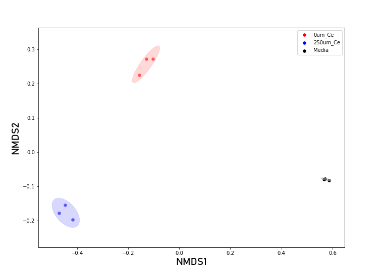

# Multivariate Analysis

Reduces the high-dimensional metabolomics dataset to a low-dimensional
view. Three ordination methods are available: **NMDS**, **PCA**, and
**PLS-DA** — all operating on the same samples × features intensity
matrix.

A settings bar above the plot controls how it's drawn and redraw
immediately on any change:

**Method** — which ordination to run:

- **NMDS** (default): nonmetric multidimensional scaling using
  Bray-Curtis dissimilarity. A rank-based embedding — samples that are
  closer together are more similar in overall metabolome. The plot
  title shows the NMDS stress (the conventional fit-quality metric);
  axis labels are NMDS1/NMDS2 (no percent-explained, since NMDS is
  not a linear decomposition of the feature space).
- **PCA**: principal component analysis on mean-centered,
  unit-variance-scaled features. Axis labels show percent of
  total variance explained by each component.
- **PLS-DA**: partial least-squares discriminant analysis, supervised
  by biological group. Axis labels show percent of explained variance
  per component. Useful when NMDS/PCA show overlapping groups but
  there's a genuine biological difference you want to maximize the
  separation of.

**View** — which aspect of the ordination to plot:

- **Scores** (default): each sample (or injection) as a point,
  coloured by biological group, with 95% confidence ellipses per
  group.
- **Loadings**: the top 25 features that most drive the separation,
  shown as arrows from the origin. Selecting a feature in another
  plot highlights it here (yellow marker at its loadings position).

**Collapse Replicates** — when checked (default on), technical
replicates are averaged together before running ordination, so each
point represents one biological sample. Uncheck to treat every
individual injection as its own point, which can be useful for
diagnosing injection-level outliers.

*MPACT multivariate ordination (NMDS scores view) with technical-replicate
averaging, showing differences between samples and biological groups,
with shaded ovals denoting 95% confidence intervals.*
