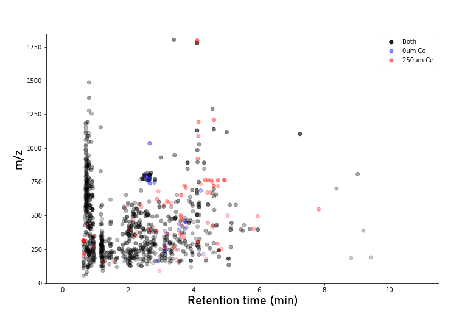

# m/z vs. RT

Plots feature mass against retention time, giving a chromatogram/isoplot-
like view of the dataset. Useful for spotting whether features of similar
mass or retention time (often a proxy for polarity) are unique to specific
groups or experimental conditions.

Features are coloured according to the [Plot Feature Sets](../user-guide/analysis-settings.md#plot-feature-sets-groupsets)
configured in Analysis Settings. Point transparency is scaled to
log-normalized abundance — more abundant features render more solidly.

*MPACT m/z vs RT plot, showing features coloured by the Plot Feature Sets
configured in Analysis Settings. Point transparency is set by
log-normalized abundance, with more abundant features rendered more
solidly.*
