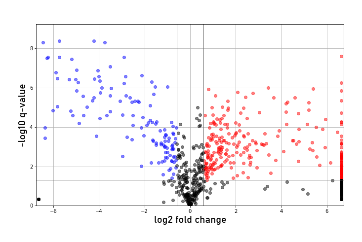

# Volcano Plot

Plots log2 fold change (experimental vs. control, as set in Analysis
Settings) against −log10(p or q value). Features upregulated in the
experimental group are shown in red, downregulated in blue.

*MPACT volcano plot — features upregulated in the experimental group are
shown in red, those downregulated in blue.*

If FDR correction was enabled in Analysis Settings, q values (Benjamini-
Hochberg-corrected) are used; otherwise raw p values are used. P values
come from error propagation of technical and biological uncertainty (root
sum of squares), with effective degrees of freedom from the
Welch–Satterthwaite equation. If only technical or only biological
replicates are available, error propagation is skipped and the available
standard deviation/n is used directly.

Significance and fold-change thresholds can be adjusted in the plot
options dialog.
