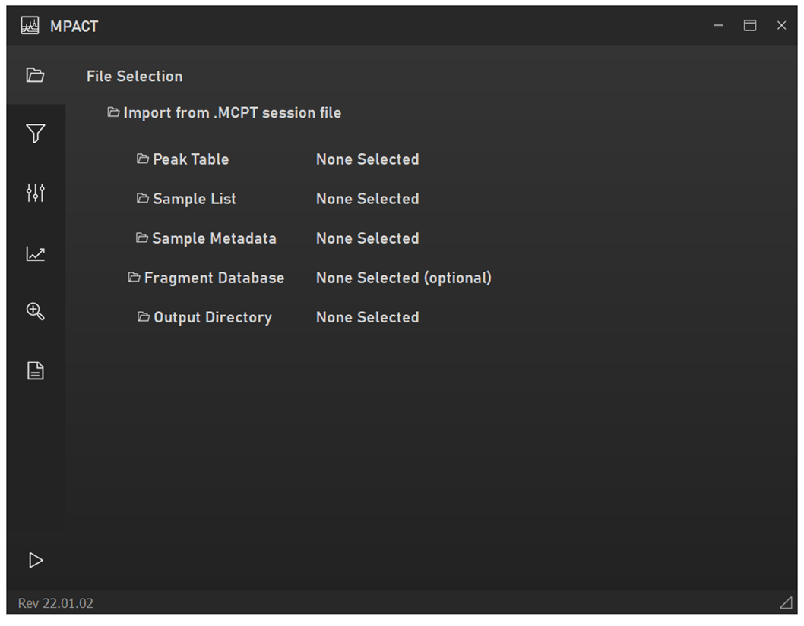
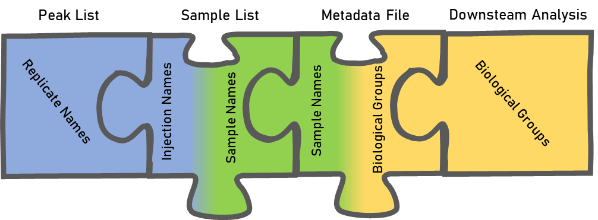
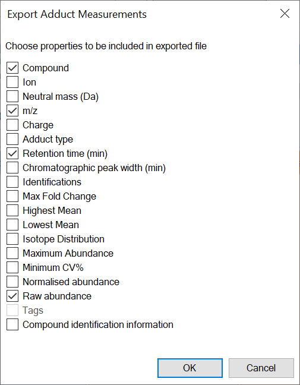
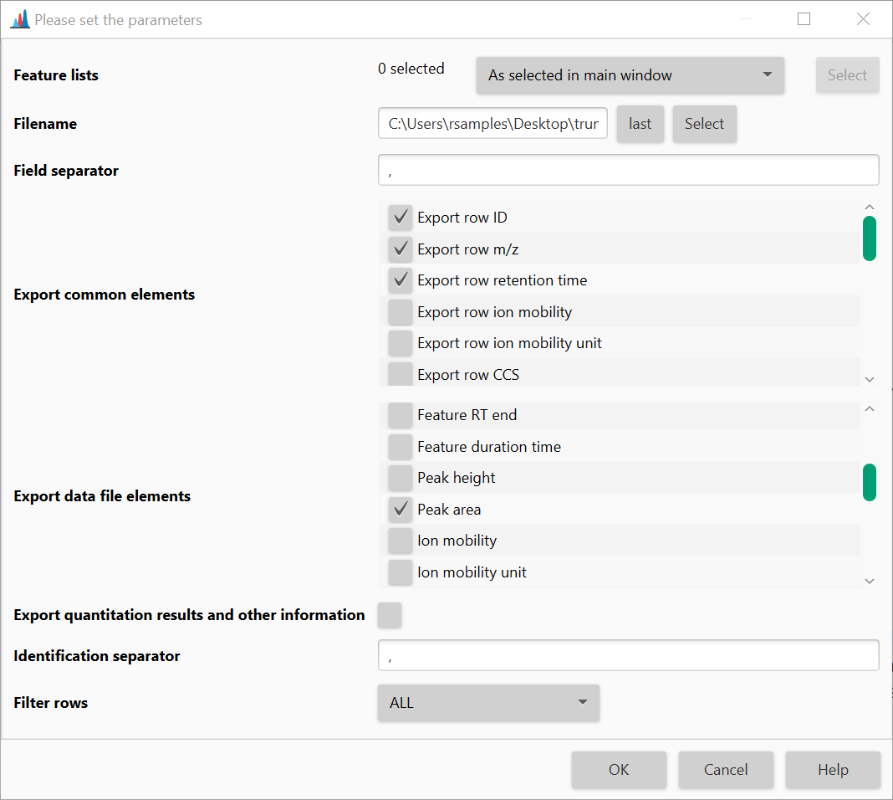
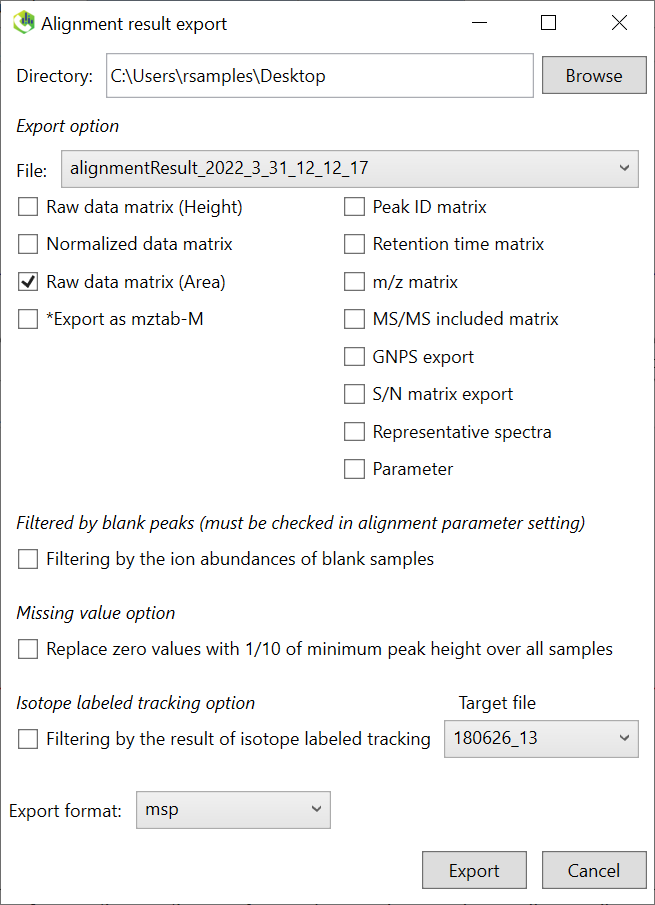
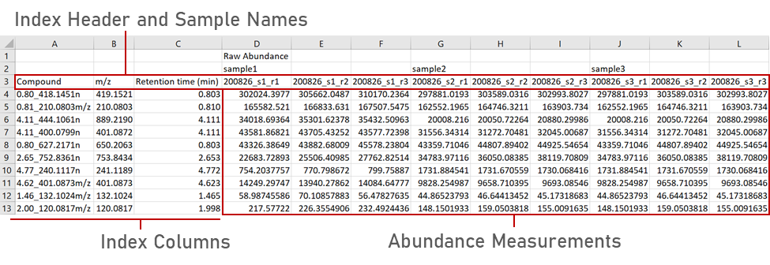
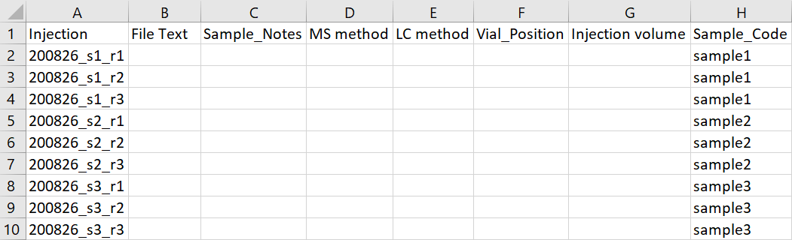
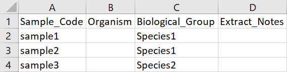

# File Selection

A minimum of three files are required to analyze a dataset in MPACT:

1. A **peak table** generated by Progenesis QI, MZmine, MS-DIAL, or Bruker
   Metaboscape.
2. A **sample list** mapping raw-data injection filenames to sample
   names/codes.
3. A **metadata file** mapping sample names/codes to biological/treatment
   groups.

You may also specify an output directory for processed data and,
optionally, an MS/MS fragment database (`.msp` or `.mgf`) so that MS2
spectra can be viewed per-feature and exported/queried against GNPS(2).

*MPACT file selection tab.*

Peak tables are normally organized by individual injection/data file, but
investigators usually care about biological/treatment groups. The sample
list and metadata file link injection filenames → sample names → biological
groups, which is what makes downstream group-level analysis possible.

## Peak table formats

!!! note "Export screenshots may be out of date"
    The export-dialog screenshots below are from the original 2022 user
    guide. Progenesis QI, MZmine, and MS-DIAL have all released new
    versions since then, so menu wording/layout may have shifted slightly
    — the general export path (aligned/reviewed feature table → export
    measurements/alignment results as CSV) should still apply.

MPACT natively supports peak tables from **Progenesis QI**, **MZmine**,
**MS-DIAL**, and **Bruker Metaboscape**. The format is auto-detected from
file content (not file extension or column position), and non-Progenesis
formats are converted in place at import time into MPACT's internal
canonical format — you don't need to convert anything by hand.

Acquisition of technical/injection triplicates is highly recommended for
maximum reproducibility and to take full advantage of MPACT's filtering and
statistics.

### Exporting a peak list from Progenesis

In the **Review Compounds** tab, select **File → Export Compound
Measurements**, and export either raw or normalized abundance.

### Exporting a peak list from MZmine

Generate an aligned feature list, then **Feature list methods → Export
feature list → CSV (legacy MZmine 2)**.

### Exporting a peak list from MS-DIAL

**Export → Alignment result**, then export with the standard alignment
export options.

### Editing a peak table from an unsupported platform

If hand-converting a peak table from an unsupported platform, the
groupings in the first two header rows don't matter for MPACT — all
replicate/sample/group information comes from the sample list and metadata
file. The third header row does matter: it must contain index headers and
individual injection/LC-MS file names. A compound name/ID column, an m/z
column, and a retention-time column are required as indices; feature
abundance per injection makes up the table body. The easiest path is to
reformat into Progenesis-style layout (by hand, or with a short R/Python
script).

*Example of a Progenesis format peak list. It is possible to import peak
table data from currently unsupported platforms by manually editing them
into Progenesis format, or with a script (R or Python work well for
reformatting).*

## Sample list

The sample list requires only an injection/file name column and the
corresponding sample name/code column (you can include more columns, but
only those two are used). This can usually be copied straight out of your
LC-MS sample queue.

*An example of an MPACT sample list linking file names in the peak list to
sample names/codes.*

## Metadata file

The metadata file requires only a sample name/code column and the
corresponding biological/treatment group column (again, extra columns are
fine).

*An example of an MPACT metadata file linking sample names/codes to
biological/treatment groups.*

## MS/MS fragment database (optional)

If provided, MPACT will parse the `.msp`/`.mgf` file and let you view MS2
spectra for matched features in the [Feature Info](../feature-info.md)
pane. On export, MPACT also writes out a peak-table-row-order-matched
("re-indexed") copy of the fragment database alongside a filtered copy of
your original peak table — see [GNPS2 export](#gnps2-export-re-indexing)
below.

### GNPS2 export / re-indexing

GNPS2 requires that MSP/MGF entry indices line up with the row order of
the peak table you submit alongside them. At the end of every analysis run,
MPACT automatically writes:

- `<name>_filtered_source.<ext>` — your original source peak table,
  row-subset down to the features that survived filtering, in the original
  source format.
- `<frag>_reindexed.msp`/`.mgf` — your fragment database, renumbered so its
  entry indices match the filtered peak table's row order.

Matching between fragment entries and peak-table rows is done by
compound-id first (exact match on the shared `Comment:`/`Name (...)` field),
falling back to m/z + retention-time tolerance matching when no ID match
exists — this matters because a Progenesis-exported MSP stores **neutral
mass**, not adduct m/z, so a naive m/z comparison against the peak table's
adduct-m/z column would never match.

Source-format export (`_filtered_source`) is currently Progenesis-only;
other peak-table formats are converted to the internal format at import
time, so their "source" format isn't preserved for re-export.
