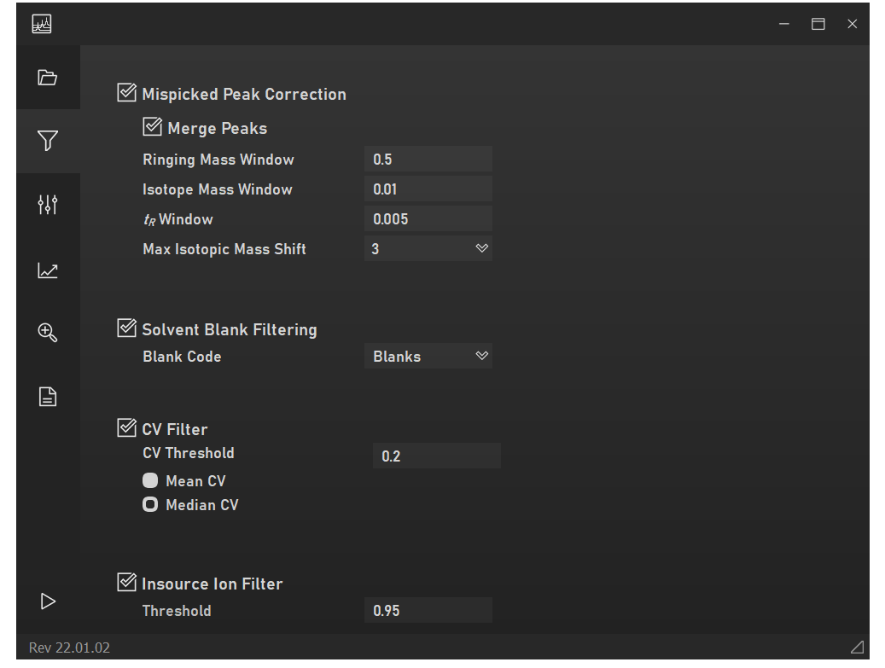
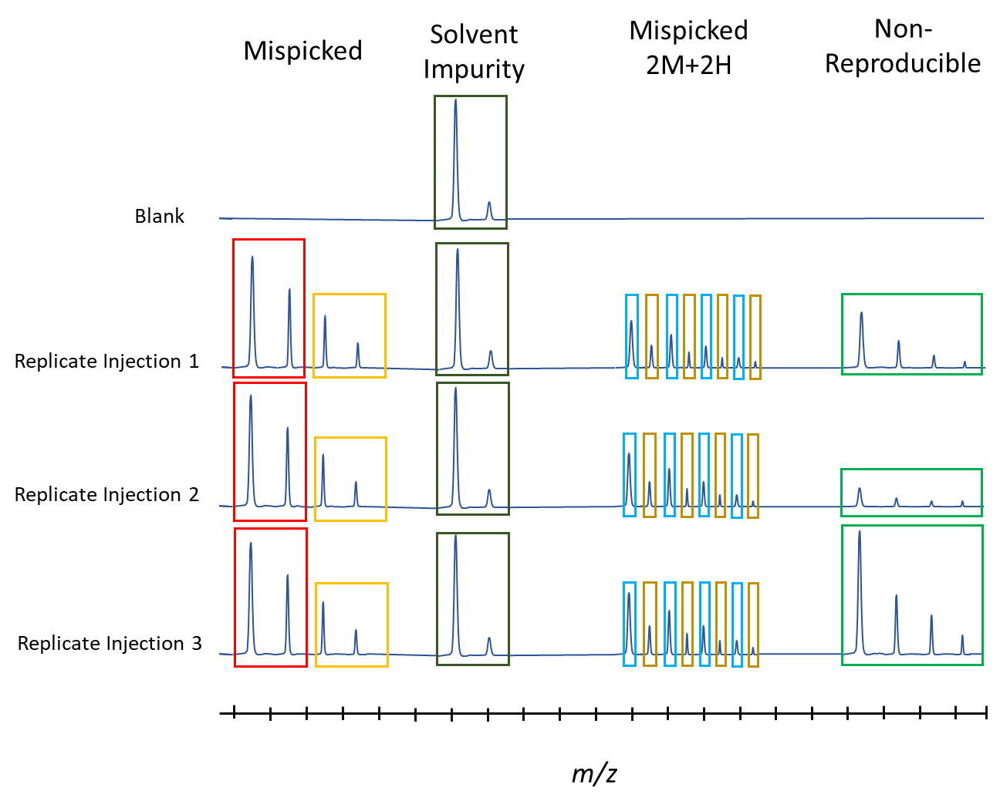
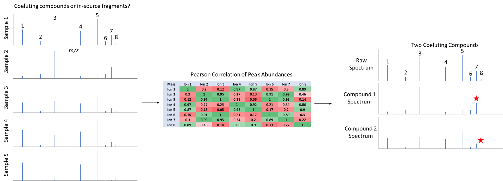

# Filtering Settings

MPACT can filter mispicked peaks, solvent-blank features, nonreproducible
features, and in-source fragment ions, based on user-specified parameters.

## Mispicked peaks

Identified as features similar in retention time and mass to a lower-mass,
higher-abundance feature — usually the result of incorrect isotope-pattern
splitting during peak picking, detector saturation artifacts, or
misidentified multiply-charged oligomers. The defaults are conservative
(low values), to minimize incorrectly merging closely related, genuinely
distinct analytes.

## Blank filtering

Features present in blanks are identified using a relative or absolute
abundance threshold (set in Analysis Settings). A relative threshold of
0.05–0.1 (filtering features present in blanks at >5–10% of their abundance
in samples) is a reasonable starting point to minimize interference from
low-level carryover between samples.

## CV (reproducibility) filtering

Filtering of nonreproducible features is based on median or mean
coefficient of variation (CV, a.k.a. relative standard deviation) among
technical replicates. **Median CV is recommended over mean CV**, since it's
less sensitive to a small number of highly nonreproducible outlier
replicates.

Published CV thresholds are generally 0.2–0.3, but for investigational
work, or when CV can't be expected to be known precisely (few samples, or
high chemical diversity causing many features to only be detected in a
handful of samples), a higher threshold up to 0.5 may be appropriate. Use
the [Dendrogram](../plots/group-analysis.md#dendrogram) results to sanity
check your threshold: pick the least stringent threshold before which
clustering quality stops meaningfully improving.

*Diagram demonstrating identification of groups that are incorrectly peak
picked (peak-picking boxes split across an isotopic pattern),
nonreproducible features, and features present in solvent blanks.*

## In-source fragment deconvolution

In-source fragments are identified by building retention-time-bounded
cosine correlation matrices within MS1 scans. Within a highly correlated
cluster of co-eluting features, the highest-mass feature is assumed to be
the parent ion, and the lower-mass features in that cluster are filtered as
likely in-source fragments. A high correlation threshold is recommended to
avoid filtering out genuinely distinct analytes that happen to be
co-regulated across samples.

*Diagram demonstrating identification of in-source fragments. A
correlation matrix is used to deconvolute groups of features at the same
retention time; the highest-mass feature in each cluster is assumed to be
the molecular ion (denoted by a red star).*
